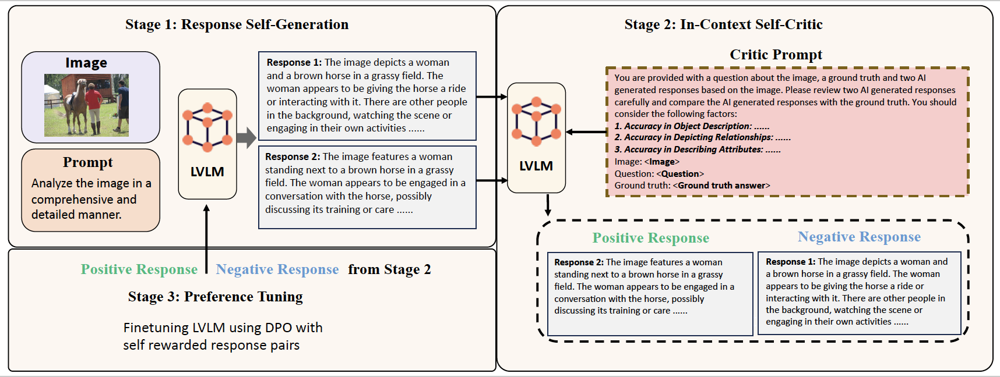

# Enhancing Visual-Language Modality Alignment in Large Vision Language Models via Self-Improvement

[Xiyao Wang](https://si0wang.github.io/), Jiuhai Chen, Zhaoyang Wang, Yuhang Zhou, [Yiyang Zhou](https://yiyangzhou.github.io/), [Huaxiu Yao](https://www.huaxiuyao.io/), [Tianyi Zhou](https://tianyizhou.github.io/), [Tom Goldstein](https://www.cs.umd.edu/~tomg/), Parminder Bhatia, [Furong Huang](https://furong-huang.com/), [Cao Xiao](https://sites.google.com/view/danicaxiao/home)
<div align="center">
</div>
<div align="center">
    <a href="https://huggingface.co/datasets/YiyangAiLab/POVID_preference_data_for_VLLMs"></a>
    <a href="https://arxiv.org/pdf/2405.15973"></a>
    <a href="https://x.com/furongh/status/1796373642382577746"></a>
</div>

<div align="center">

</div>
Flowchart of the Self_Improvement Modality Alignment (SIMA) framework. SIMA consists of three parts: Response Self-Generation, In-Context
Self-Critic, and Preference Tuning.

## Getting Started
### Installation and Training

**1. Prepare the code and the environment**
```bash
git clone https://github.com/si0wang/SIMA.git
cd SIMA
conda env create -f environment.yaml
```

**2. Prepare the dataset for experiment**

**Download COCO2017 training set**: 
```bash
mkdir LLAVA_DPO_data
cd LLAVA_DPO_data
wget http://images.cocodataset.org/zips/train2017.zip
unzip train2017.zip
rm train2017.zip
```

**Download prompts for Self Response Generation**: 

You can download our prompts for response self-generation from [Hugingface](https://huggingface.co/datasets/furonghuang-lab/SIMA_prompts).
You can also make your own prompt set by sampling prompts from [LLaVA-Instruct-150K](https://huggingface.co/datasets/liuhaotian/LLaVA-Instruct-150K).
Remember to keep the prompt file as the following format and save as jsonl file:
```
{
        "image": "000000401804.jpg", 
        "text": "Explain the visual content of the image in great detail.", 
        "ground_truth": "In this image, a group of people is riding on the back of several elephants within a forest setting. There are five individuals visible, each riding on or standing close to an elephant. A total of four elephants can be seen, all standing next to each other, creating a scene where these majestic creatures interact closely with the humans in the midst of nature. The people are spread evenly among the elephants, enjoying this unique experience in the lush green surroundings."
}
```

**3. Response Self-Generation**
```bash
bash scripts/response_self_generation.sh
```

**4. In-Context Self-Critic**
```bash
bash scripts/prompt_for_critic.sh
bash scripts/self_critic.sh
bash scripts/make_dpo_dataset.sh
```

**4. Preference Tuning**
```bash
bash scripts/run_dpo.sh
```

**Our models**:

| [LLaVA-1.5-7b](https://huggingface.co/furonghuang-lab/LLaVA-1.5-7B-SIMA) | [LLaVA-1.5-13b](https://huggingface.co/furonghuang-lab/LLaVA-1.5-13B-SIMA) |


 
### Evaluation

For detailed tutorials on benchmark evaluation, please refer to [LLaVa](https://github.com/haotian-liu/LLaVA/blob/main/docs/Evaluation.md), [Mementos](https://github.com/umd-huang-lab/Mementos), and [LURE](https://github.com/YiyangZhou/LURE) (Chair).
You need to merge your model first:
```bash
bash scripts/merge_lora.sh
```

## Other things
Because the DPO code in trl library does not provide image token processing, you need to modify the library function according to the following process:
```bash
cd *your conda path*/envs/sima/lib/python3.10/site-packages/trl/trainer/
```
Replace *dop_trainer.py* with *dop_trainer.py* in the *'tool/'* folder. 

## Acknowledgement
Our code is built upon [LLaVA 1.5](https://github.com/haotian-liu/LLaVA) and [POVID](https://github.com/YiyangZhou/POVID). We thank all these authors for their nicely open sourced code and their great contributions to the community.

## Citation
If you found this work useful, consider giving this repository a star and citing our paper as followed:
```
@misc{wang2024enhancing,
      title={Enhancing Visual-Language Modality Alignment in Large Vision Language Models via Self-Improvement}, 
      author={Xiyao Wang and Jiuhai Chen and Zhaoyang Wang and Yuhang Zhou and Yiyang Zhou and Huaxiu Yao and Tianyi Zhou and Tom Goldstein and Parminder Bhatia and Furong Huang and Cao Xiao},
      year={2024},
      eprint={2405.15973},
      archivePrefix={arXiv},
      primaryClass={cs.CV}
}
```